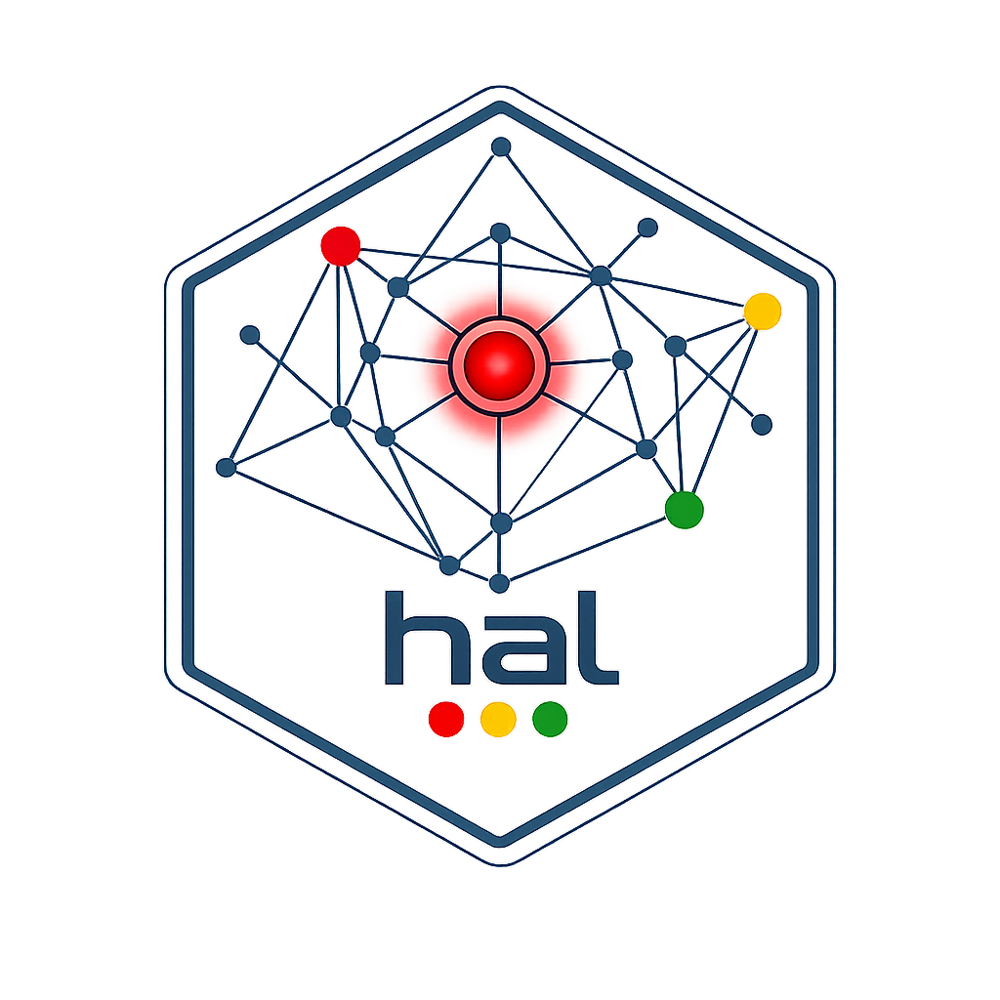
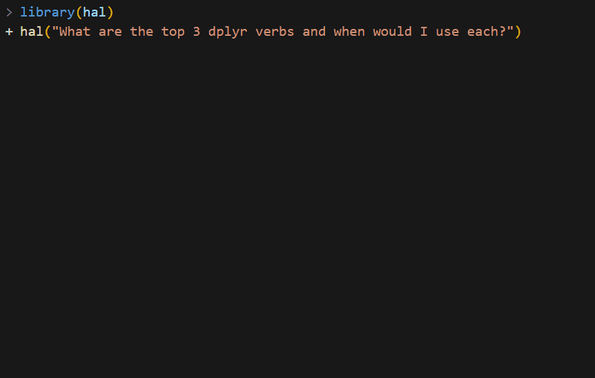
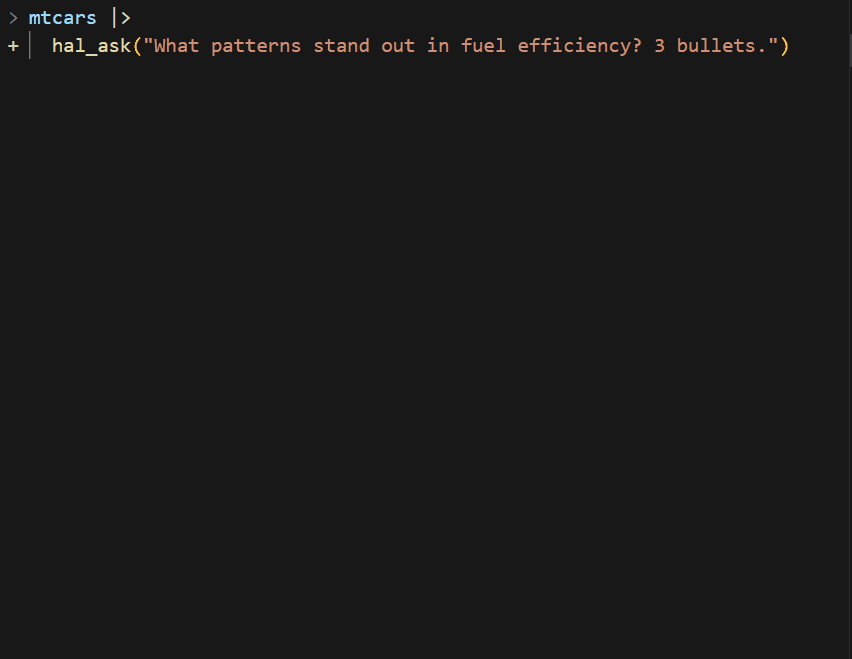
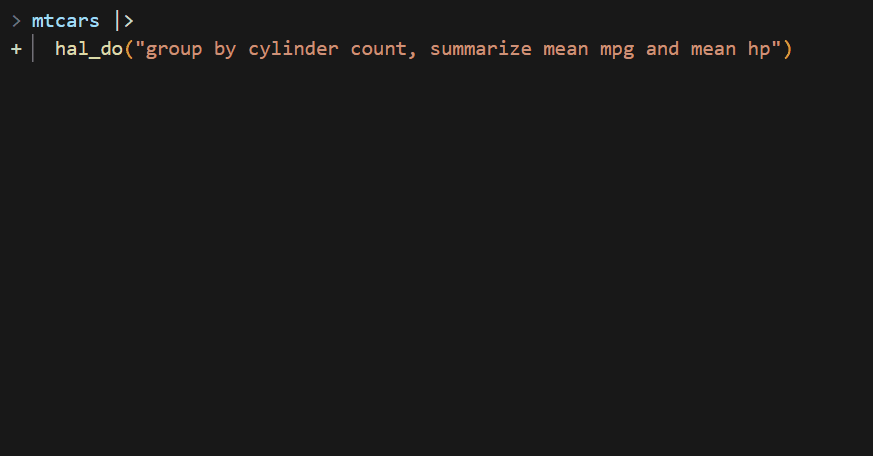
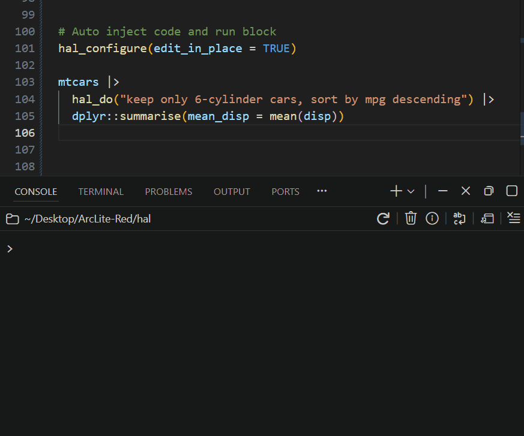

<!-- README.md is generated from README.Rmd. Please edit that file -->

```{r, include = FALSE}
knitr::opts_chunk$set(
  collapse = TRUE,
  comment = "#>",
  fig.path = "man/figures/README-",
  out.width = "100%",
  eval = FALSE
)
```

# hal <a href="https://arclite-red.github.io/hal/"></a>

<!-- badges: start -->
[](https://github.com/ArcLite-Red/hal/actions/workflows/R-CMD-check.yaml)
<!-- badges: end -->

**A coding agent for R.** Not a chatbot -- an agent that reads your
code, searches your codebase, edits files, and runs commands. Zero API
keys, three pluggable backends:

- **vscode** *(default in Positron)* -- talks to `vscode.lm` via the
  bundled hal-bridge extension. No CLI install, no extra auth beyond
  your Positron Copilot sign-in, and `eval_r` round-trips through R
  directly without an MCP subprocess. The lowest-friction path.
- **Copilot** -- GitHub Copilot CLI in ACP mode. 17 models, flat
  subscription, mid-session model switching with preserved context,
  Plan / Autopilot modes.
- **Claude** -- Anthropic Claude Code CLI. 3 models, 5-hour quota
  visibility via `hal_quota()`, plugs into the Claude Code skills /
  hooks / MCP ecosystem.

If you're in Positron, do nothing -- `hal_setup()` installs the bridge
from `inst/extdata/` in one call and you're off. If you're elsewhere,
`hal_setup()` installs the Copilot CLI. Switch any time with
`hal_configure(backend = "...")`.

Bullet features:

- **Full coding agent** -- file read/write, code search, shell commands
  on Copilot and Claude; chat + `eval_r` + custom tools on vscode
- **Pluggable backend** -- one R interface, three transports
- **Zero API keys** -- piggybacks on your existing Copilot / Claude
  subscription
- **Custom tools via MCP / direct** -- turn any R function into an
  LLM-callable tool
- **Environment-aware** -- `use_env = TRUE` lets the agent read live R
  objects via `eval_r`
- **Project memory** -- `hal.md` persists context across sessions
- **Built-in governance** -- credential scanning, eval denylist,
  permissions
- **Edit-in-place** -- `hal_do()` replaces itself in your script with
  generated code
- **Spreadsheet migration** -- `hal_excel()` turns an `.xlsx` into a
  verified tidyverse script, checked cell-for-cell against Excel's own
  cached values
- **Plot vision** -- plots drawn by `eval_r` are captured and sent to
  the model as images (vscode + claude backends), so it can see and
  iterate on your actual charts
- **Verified transforms** -- `hal_do()` reports row/column/NA deltas
  after every transform and warns when output looks suspicious

## Install

```r
# install.packages("pak")
pak::pak("ArcLite-Red/hal")
library(hal)

hal_setup()    # auto-picks the right backend for your host
```

`hal_setup()` walks you through the appropriate path. In Positron it
installs the hal-bridge extension from the VSIX bundled with hal (no
download, no GitHub auth); elsewhere it installs the Copilot CLI.

Pick a different backend explicitly if you want:

```r
hal_configure(backend = "vscode")    # Positron + hal-bridge extension
hal_configure(backend = "copilot")   # GitHub Copilot CLI (ACP)
hal_configure(backend = "claude")    # Anthropic Claude Code CLI
```

Verify (one traffic-light report, ends with the next step if anything is
missing):

```r
hal_status()
#> -- hal status ------------------------------------------------------
#> i hal 0.1.4 | backend: "vscode" (auto: Positron detected)
#> v hal-bridge 0.1.4 responding on port 51234.
#> i No active session (one starts on your first hal() call).
#> v Ready. Try: hal("Hello!")
```

## Converse

Multi-turn conversation with a coding agent. Session persists across calls.

```r
hal("What are the top 3 dplyr verbs and when would I use each?")
```



```r
hal("Show me a filter example")
hal("Now group_by and summarise")
```

## Analyze data

Pipe any object into `hal_ask()`. Your data flows through unchanged.

```r
mtcars |>
  hal_ask("What patterns stand out in fuel efficiency? 3 bullets.")
```



## Generate code

`hal_do()` generates R code, executes it, and returns the result --
then verifies the transform and reports what structurally changed:

```r
mtcars |>
  hal_do("group by cylinder count, summarize mean mpg and mean hp")
#> i hal_do: 32 -> 3 rows | -9 cols (...) | +2 cols (mean_mpg, mean_hp)
```

The full report lives at `attr(result, "hal_verify")`; suspicious
output (identical to input, 0 rows) warns. Report-only -- it never
changes your data.



In RStudio or Positron, `hal_do()` replaces itself in your editor with the
generated code:



## Replace a spreadsheet

`hal_excel()` reads an `.xlsx`, treats the non-formula columns as data,
and translates each formula column into a tidyverse expression -- then
**verifies every translation against the values Excel itself cached**,
row for row. Columns that match go into a live `mutate()` pipeline;
anything that doesn't is emitted as a commented stub to review. The
result is a runnable R script that replaces the workbook:

```r
hal_excel("sales_model.xlsx")
#> v revenue: verified (120/120 rows match Excel)
#> v margin: verified (120/120 rows match Excel)
#>
#> data <- openxlsx2::read_xlsx("sales_model.xlsx", sheet = "Sheet1", ...)
#> result <- data |>
#>   dplyr::mutate(
#>     revenue = units * unit_price,
#>     margin = (revenue - cost) / revenue
#>   )

code <- hal_excel("sales_model.xlsx")
attr(code, "hal_excel")          # per-column verification report
writeLines(code, "sales_model.R")
```

If you run it from an open script, it replaces the `hal_excel()` call
with the generated code -- the spreadsheet-to-script migration is one
line.

## See your plots

On the vscode and claude backends, plots drawn by `eval_r` are captured
and sent to the model as images -- it critiques what the chart actually
looks like, not what the code suggests it might:

```r
df <- mtcars
hal("Draw a scatter of mpg vs wt and describe the relationship you see")
#> i hal: plot captured for the model.
# ... the model references the actual visual: clusters, outliers, curvature

hal("Make it publication-ready: labels, theme, annotate the outliers")
# It sees each iteration and refines against the rendered result.
```

Returned ggplot objects are printed to your device too, so everything
shows up in your plots pane as usual. Disable with
`hal_configure(plot_vision = FALSE)`.

## Go further

```r
# Give the agent access to live objects in your R session
df <- mtcars
hal("Which rows in df have above-median mpg?", use_env = TRUE)

# Mid-pipe transform with retry on failure
iris |>
  hal_do("z-score each numeric column, ignoring Species", .retries = 2)

# Switch models on the fly (Copilot; Claude resets via hal_reset())
hal("Summarize this codebase", model = "claude-haiku-4.5")
hal("Now review it for edge cases", model = "claude-opus-5")

# Register custom tools
hal_register_tool(
  fun = function(ticker) paste("$142.50 for", ticker),
  name = "stock_price",
  description = "Get current stock price",
  types = list(ticker = "string")
)
hal("What's the stock price of AAPL?")

# Track usage and (on Claude) the 5-hour quota window
hal_usage()
hal_quota()

# R6 API for multiple sessions, Shiny, or full control
chat <- hal_chat(model = "claude-sonnet-5", echo = "all")
chat$chat("Read DESCRIPTION and list the dependencies")
chat$switch_model("gpt-4.1")
chat$chat("Are any of those dependencies unnecessary?")
```

## How it works

```
              R session
                 |
                 v
            hal (R6 + S3)        one API, pluggable transport
                 |
    +------------+------------+
    |            |            |
    v            v            v
  vscode      Copilot       Claude
 localhost      ACP        -p / resume
   HTTP       server        per-turn
    |            |            |
    v            v            v
 hal-bridge    GitHub      Anthropic
 vscode.lm    Copilot       Claude
 (Positron)  17 models     3 models
```

All three transports converge on the same `hal_response` / `hal_turn` /
`hal_tool_call` S3 objects, so your code doesn't care which backend you
pick. vscode speaks HTTP to the localhost bridge; Copilot and Claude
speak NDJSON / stream-json over stdio.

hal's Copilot path uses the ACP transport (not the HTTP proxy).
Multi-turn Claude via HTTP has a known format-translation bug; via ACP
it works correctly.

## Learn more

- `vignette("getting-started")` -- setup, configuration, backends, full walkthrough
- `vignette("backends")` -- vscode / Copilot / Claude trade-offs, costs, quota
- `vignette("agent-tools")` -- built-in tools, `eval_r`, permissions, custom MCP tools
- [Reference docs](https://arclite-red.github.io/hal/) -- full API reference
